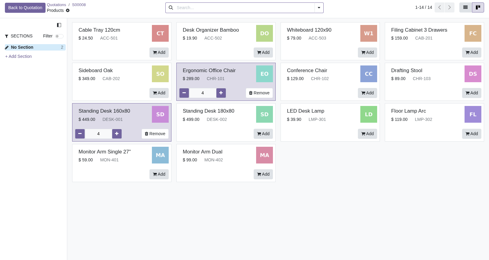
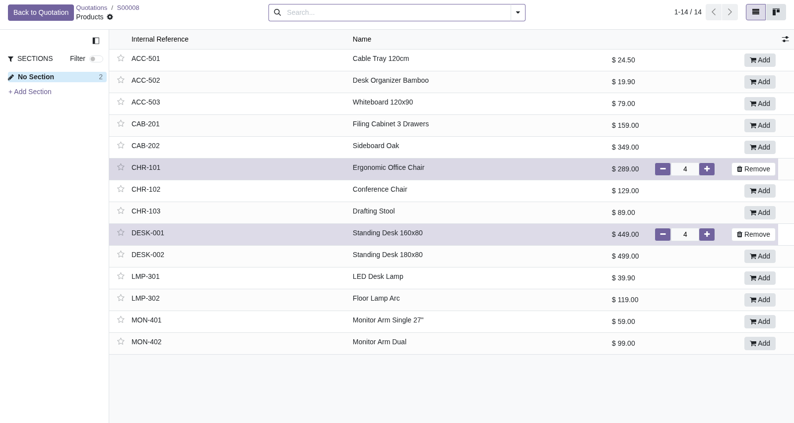

# Product Catalog Compact List

Adds a compact list view to the product catalog (the "Catalog" screen used to
add products to sale orders, purchase orders, invoices, ...).

You might also want to have a look at
[invoice_product_multi_add](https://github.com/derico-de/invoice_product_multi_add),
which solves the same problem slightly differently.
They can be installed together.

## Why

The default catalog only offers a kanban view whose cards show a product image
and take a lot of space.

With a large product range the list view fits many
more products on one screen while keeping the full catalog behavior:

- clicking a row adds the product to the order,
- the quantity can be changed directly in the row (+/-, direct input),
- price display and the *Back to Quotation/Order* button work exactly like in
  the kanban catalog.

For sale orders the catalog opens in the list view by default; the kanban view
stays available through the view switcher. On other documents (purchase
orders, invoices, ...) the catalog still opens in kanban and the list view is
offered in the view switcher.

## Usage

1. Open a sale order and click *Catalog* above the order lines.
2. Click a row (or the *Add* button) to add the product to the order.
3. Adjust the quantity with *+* / *-* or by typing into the quantity field.
4. Click *Back to Quotation* to return to the order.

## Technical notes

- The list view reuses the catalog kanban machinery (`ProductCatalogKanbanModel`,
  `ProductCatalogKanbanRecord`, `ProductCatalogKanbanController`) through
  call-time delegation, so core and third-party patches (purchase, account,
  mrp, ...) keep working in the list view.
- To make the list view the default on another model, override
  `action_add_from_catalog` on that model (after `super()`) and move the
  `list` entry of `action["views"]` to the front — see `models/sale_order.py`.

## Known limitations

- Section handling (invoices/purchase orders with sections) follows the
  currently selected section only for the quantity widget, not for the
  row-click shortcut.

## Authors

- [derico](https://derico.de)

## Contributors

- Maik Derstappen \<md@derico.de\> ([derico](https://derico.de))
